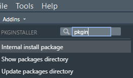
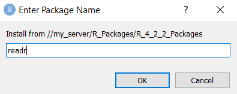
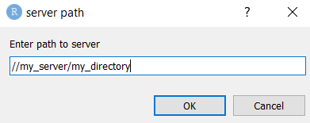

<!-- README.md is generated from README.Rmd. Please edit that file -->

```{r, include = FALSE}
knitr::opts_chunk$set(
  collapse = TRUE,
  comment = "#>",
  fig.path = "man/figures/README-",
  out.width = "100%"
)
```

# pkginstaller

<!-- badges: start -->
[](https://github.com/DataScienceScotland/pkginstaller/actions)
<!-- badges: end -->

An R Studio Add-in to make it easier to install packages from an internal server.

For locked down IT environments where cannot install packages from CRAN directly, but where packages are stored on an internal server. 


## Installation

You can install pkginstaller from [GitHub](https://github.com/) with:

``` r
remotes::install_github("DataScienceScotland/pkginstaller", upgrade="never")
```

If security settings prevent you installing this package from GitHub directly, download its [zip file](https://github.com/DataScienceScotland/pkginstaller/archive/refs/heads/main.zip) and use the code below to install (after replacing `<FILEPATH OF ZIPPED FILE>` with the directory of the downloaded zip),

```{r source-installation, eval = FALSE}
remotes::install_local(
  "<FILEPATH OF ZIPPED FILE>/pkginstaller-main.zip",
  upgrade = "never"
)
```

## Packages directory

It is recommended that the directory containing the packages has PACKAGES index files, created with:
```{r eval=FALSE}
tools::write_PACKAGES(dir = "packages_dir", type = "win.binary")
```
The index files allow a package to be installed and its dependent packages to be installed automatically.

## Package installation prcoess

This makes use of the `contriburl` argument of `install.packages` to specify the server directory. For example:

```{r eval=FALSE}
install.packages("tidyr", repos = NULL, type = "win.binary", contriburl = "file://internal_server/r422_packages")
```

## Using the add-in

Once the package is installed, use the pkginstaller Addins found in R Studio  




## Installing a package with the add-in

Select "Internal install package" from the pkginstaller Addin menu. A pop-up will open where should specify the name of the package to install.  

  


## Checking the current packages server directory
Select "Show packages directory" from the pkginstaller Addin menu. The current directory should be printed in the console.


## Updating the current packages server directory
If the current check shows the directory needs changing, then run "Update packages directory" from the Addin menu. A pop-up will open and should specify the updated directory containing packages to install.  

  


When specifying the server directory, please note:

1. Use forward slashes not back slashes in the directory as would be used in R code.

2. It is not necessary to specify `file:` at the start of the directory as this will be added automatically.
