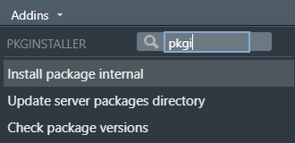

<!-- README.md is generated from README.Rmd. Please edit that file -->

# pkginstaller

<!-- badges: start -->

[](https://github.com/DataScienceScotland/pkginstaller/actions)
<!-- badges: end -->

An R Studio Add-in to make it easier to install packages from an
internal server.

For locked down IT environments where cannot install packages from CRAN
directly, but where packages are stored on an internal server.

## Installation

You can install pkginstaller from [GitHub](https://github.com/) using
the
[remotes](https://cran.r-project.org/web/packages/remotes/index.html)
library:

``` r
remotes::install_github("DataScienceScotland/pkginstaller", upgrade="never")
```

If security settings prevent you installing this package from GitHub
directly, download its [zip
file](https://github.com/DataScienceScotland/pkginstaller/archive/refs/heads/main.zip)
and use the code below to install (after replacing
`<FILEPATH OF ZIPPED FILE>` with the directory of the downloaded zip):

``` r
remotes::install_local(
  "<FILEPATH OF ZIPPED FILE>/pkginstaller-main.zip",
  upgrade = "never"
)
```

## Using the add-in

Once the package is installed, use pkginstaller from the Addins menu
found in R Studio.



## Installing a package with the add-in

Select “Install package internal” from the pkginstaller Addin menu. A
pop-up will open where should specify the name of the package to
install. Check the directory shown is the correct location of the R
packages. If it’s not see next section.


## Updating the current packages server directory

If the packages directory needs changing, then run “Update server
packages directory” from the Addin menu. A pop-up will open and should
specify the updated directory containing packages to install.


When specifying the server directory, please note:

1.  Use forward slashes not back slashes in the directory as would be
    used in R code.

2.  It is not necessary to specify `file:` at the start of the directory
    as this will be added automatically.

## The underlying package installation command

This package installation process makes use of the `contriburl` argument
of `install.packages`. `contriburl` is used to specify the server
directory containing compiled Windows binary zip files for each R
package. The command it uses is like the following:

``` r
install.packages("tidyr", repos = NULL, type = "win.binary", contriburl = "file://internal_server/R_4_2_2_Packages")
```

The `type` argument is currently hard coded as `"win.binary"`, therefore
the server directory should contain Windows binaries, not source
tarballs or macOS builds. The server directory also needs index files.
See below.

## Setting up the server directory

A pre-requisite is the directory containing the packages has PACKAGES
index files, created with:

``` r
tools::write_PACKAGES(dir = "packages_dir", type = "win.binary")
```

The index files allow a package to be installed and its dependent
packages to be installed automatically.
